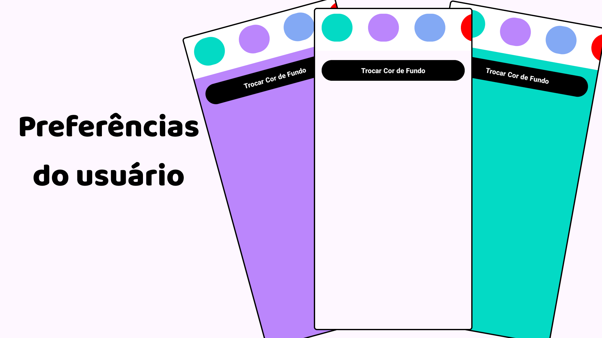
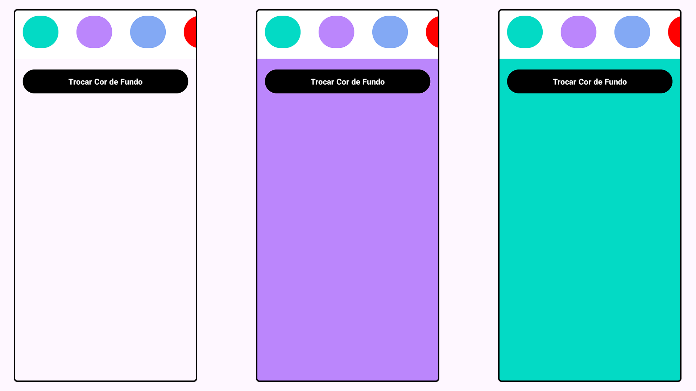

# 🎨 Preferências do Usuário – Salvando Configurações no Android  

Este projeto foi desenvolvido em **Kotlin com Android Studio** e tem como objetivo demonstrar o uso do **SharedPreferences** para salvar as preferências do usuário, permitindo que ele escolha e mantenha a cor de fundo do aplicativo mesmo após fechar e abrir novamente.  

A ideia é simples, mas poderosa: mostrar como pequenas configurações personalizadas podem melhorar a experiência de quem utiliza o app.  

---

## 🚀 Funcionalidades  

- Alterar a cor de fundo do aplicativo.  
- Salvar a cor escolhida utilizando **SharedPreferences**.  
- Restaurar automaticamente a cor salva ao reabrir o app.  
- Exibir uma **Snackbar** confirmando a alteração da cor.  

---

## 🖼️ Prints das Telas  

   

